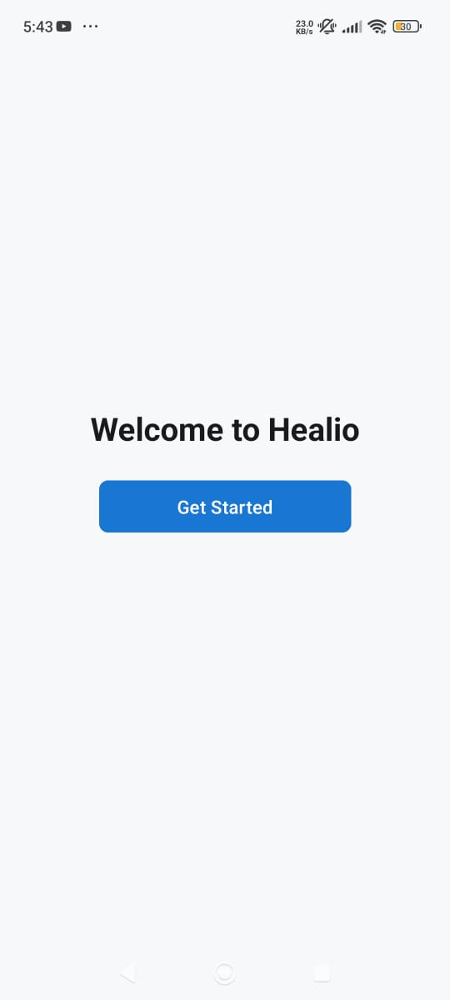
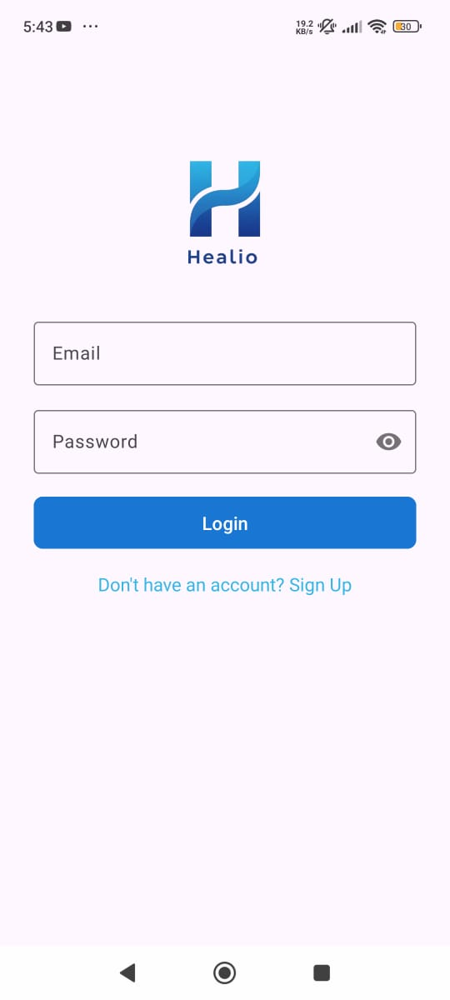
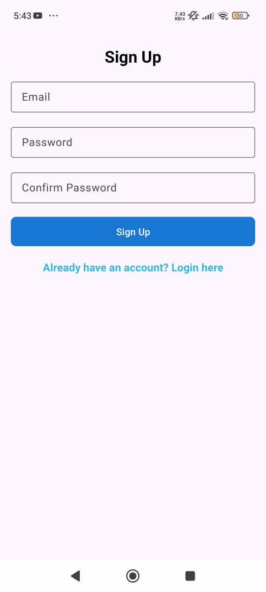
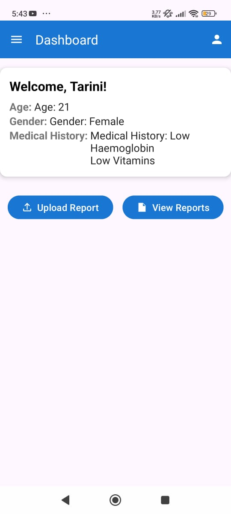
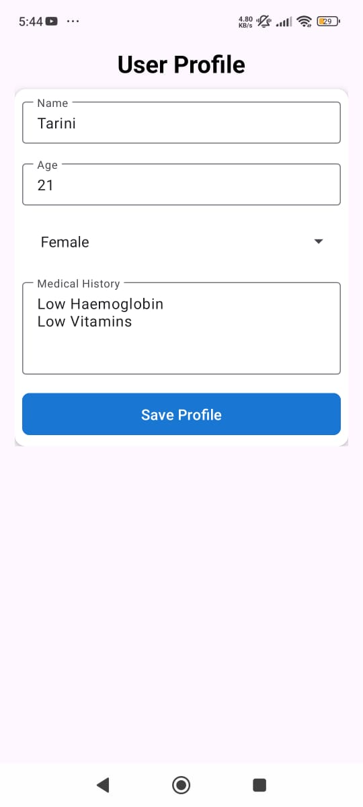
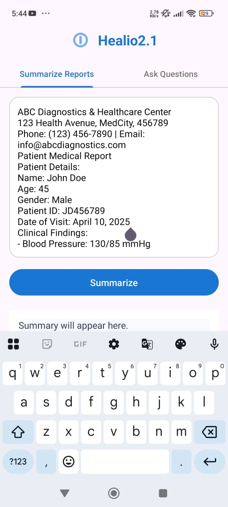
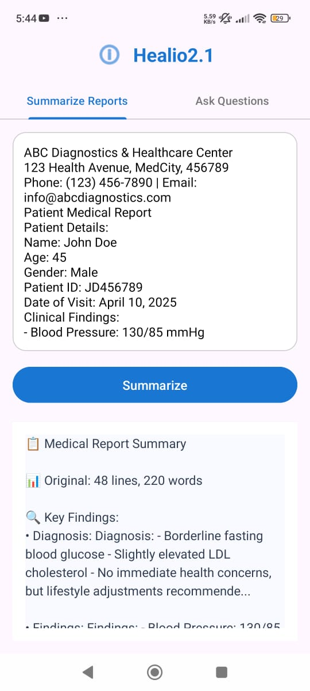
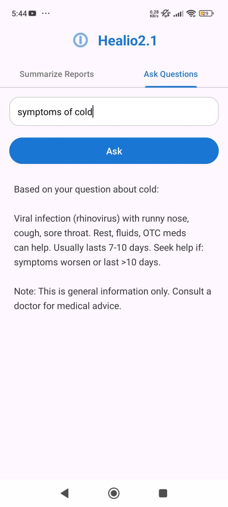

# Healio – Smart Health Report Assistant

Healio is an Android app that allows users to upload their medical report PDFs, extract text from them on-device, and get AI-generated summaries in simple language. It also features an integrated chatbot to answer health-related queries based on the report content.

## ✨ Features

- 📄 **Upload Medical Reports** – Select and upload health report PDFs from your device.
- 🔍 **On-Device Text Extraction** – Uses Apache PDFBox (Tom Roush port) for fast, local text parsing.
- 🧠 **Report Summary** – Converts medical jargon into user-friendly summaries.
- 💬 **Chatbot** – Ask questions about your medical report via a chatbot.
- 🔐 **Firebase Auth** – Secure login and signup with Firebase Authentication.
- ☁️ **Firestore Integration** – Store user data and medical history securely in the cloud.
- 📱 **Modern UI** – Clean and responsive design with ConstraintLayout, card views, and vector icons.

## 📷 Screenshots
**Start Screen**



**Login Screen**



**Signup Screen**



**Dashboard Screen**



**User Profile Screen**



**Upload Report Screen**


**Extracted Text**



**Summarize Screen**



**Summarize Screen**


**Chatbot Screen**



## 🛠️ Tech Stack

- **Language:** Java  
- **IDE:** Android Studio  
- **Database:** Firebase Firestore  
- **Authentication:** Firebase Auth  
- **PDF Extraction:** Apache PDFBox (Tom Roush port)  
- **UI/UX:** Material Design, ConstraintLayout
- **Gradle:** - Groovy Gradle


## 🚀 Getting Started

1. **Clone the Repository**
   ```bash
   git clone https://github.com/your-username/healio-android-app.git
   ```

2. **Open in Android Studio**
   - Open Android Studio.
   - Select **"Open an existing project"** and choose the cloned folder.

3. **Build & Run**
   - Make sure Gradle syncs without issues.
   - Connect an emulator or Android device.
   - Click **Run ▶️**.

4. **Dependencies**
   - Groovy-based Gradle build.
   - Apache PDFBox (Tom Roush port).
   - Firebase Auth + Firestore.

## 📁 Project Structure

This app uses standard Android architecture with Activities and Fragments. Firebase integration is used for authentication and cloud storage. PDFBox is used locally for text extraction.

## 📄 License

This project is licensed under the MIT License - see the [LICENSE](LICENSE) file for details.
